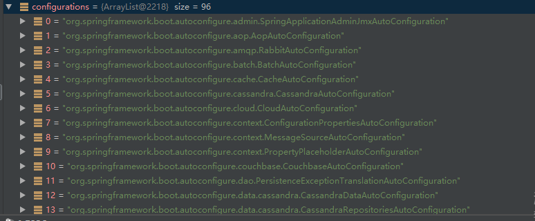
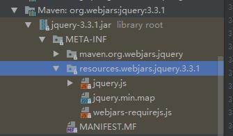

# 一、Spring Boot入门

## 1、Spring Boot简介

> 简化Spring应用开发的一个框架；
>
> 整个Spring技术栈的一个大整合；
>
> J2EE开发的一站式解决方案

## 2、微服务

2014，martin flower

微服务：架构风格

一个应用应该是一组小型服务；可以通过HTTP的方式进行互通；

每一个功能元素最终都是一个可独立替换和独立升级的软件单元；

详细参照微服务文档：<https://martinfowler.com/articles/microservices.html#MicroservicesAndSoa>

单体应用：

## 5、Hello World探究

### 1、POM文件

### 2、主程序类、主入口类

@SpringBootApplication:Spring Boot应用标注在某个类上说明这个类是SpringBoot的主配置类，SpringBoot就应该运行这个类的main方法来启动SpringBoot应用

```java
@Target(ElementType.TYPE)
@Retention(RetentionPolicy.RUNTIME)
@Documented
@Inherited
@SpringBootConfiguration
@EnableAutoConfiguration
@ComponentScan(excludeFilters = {
		@Filter(type = FilterType.CUSTOM, classes = TypeExcludeFilter.class),
		@Filter(type = FilterType.CUSTOM, classes = AutoConfigurationExcludeFilter.class) })
public @interface SpringBootApplication {
```

**@SpringBootConfiguration**:SpringBoot的配置类，标注在某个类上，表示这是一个SpringBoot的配置类；

​	**@Configuration**:配置类

**@EnableAutoConfiguration**：开启自动配置功能；以前我们需要配置的东西，SpringBoot帮我们自动配置；@EnableAutoConfiguration告诉SpringBoot开启自动配置功能，这样自动配置才能生效

```java
@AutoConfigurationPackage
@Import(EnableAutoConfigurationImportSelector.class)
public @interface EnableAutoConfiguration {
```

**@AutoConfigurationPackage **：自动配置包

​	@Import(AutoConfigurationPackages.Registrar.class)：

​	Spring的底层注解@Import，给容器中导入一个组件；导入的组件有AutoConfigurationPackages.Registrar.class；将主配置类（@SpringBootApplication标注的类）的所在包及下面的所有子包

@Import(EnableAutoConfigurationImportSelector.class)：导入哪些组件的选择器；

​	EnableAutoConfigurationImportSelector.class:将所有需要导入的组件以全类名的方式返回，这些组件就会被添加到容器中；会给容器中导入非常多的自动配置类（xxxAutoConfiguration）；



有了自动配置类，免去了我们手动编写配置注入功能主键等的工作；

```
SpringFactoriesLoader.loadFactoryNames(
      getSpringFactoriesLoaderFactoryClass(), getBeanClassLoader());
```

== SpringBoot在启动的时候从类路径下的META-INF/spring.factories中获取EnableAutoConfiguration指定的值，将这些值作为自动配置类导入到容器中，自动配置类就生效，帮我们进行自动配置工作。 == 以前需要我们自己配置的东西，自动配置类都帮我们做了。

J2EE的整体整合解决方案和自动配置都在B:\home\repository\org\springframework\spring-core\4.3.13.RELEASE\spring-core-4.3.13.RELEASE.jar

## 6、快速创建Spring Boot项目

* resouces文件夹：
  * static：保存所有的静态资源，js，css，images
  * templates：保存所有的模板页面（SpringBoot默认jar包使用嵌入式Tomcat，默认不支持JSP页面）；可以使用模板引擎（Freemarker,thymeleaf）
  * application.properties:SpringBoot应用的配置文件

# 二、配置文件

## 1、配置文件

SpringBoot使用一个全局的配置文件，配置文件名是固定的；

* application.properties
* application.yml

配置文件的作用：修改SpringBoot自动配置的默认值，SpringBoot在底层都给我们自动配置好；


yaml文件以数据为中心，比json，xml等更适合做配置文件

yaml配置示例

```yaml
server:
  port: 8081
```

xml:

```xml
<server>
  <port>8081</port>
</server>
```

## 2、YAML语法

### 1、基本语法

k:（空格）v :表示一对键值对（空格必须有）

以**空格**的缩进来控制层级关系；只要是左对齐的一列数据，都是同一个层级的；

```yaml
server:
   port: 8081
   path: /hello
```

属性和值也是大小写敏感；

### 2、值的写法

**字面量：普通的值（数字，字符串，布尔）**

k: v :字面量直接来写

​	字符串默认不用加上单引号或者双引号

​	"":双引号不会转义特殊字符

​		name: “zhangsan \n lisi” 输出:  zhangsan 换行 lisi

​	'':单引号会转义特殊字符

​		name: 'zhangsan \n lisi'  输出:  zhangsan \n lisi

**对象、Map（属性和值）（键值对）：**

k: v : 在下一行来写对象的属性和值的关系；注意缩进

```yaml
friends:
  lastName: zhansan
  age: 30
```

行内写法：

```yaml
friends: {lastName: zhangsan,age: 18}
```

**数组（List、Set）**

用-值表示数组中的一个元素

```yaml
pets:
 - cat
 - dog
 - pig
```

行内写法

```yaml
pets: [cat,dog,pig]
```

## 3、配置文件注入

```yaml
person:
    lastName: zhangsan
    age: 18
    boss: false
    birth: 2017/12/12
    maps: {k1: v1,k2: 12}
    lists:
      - lisi
      - zhaoliu
    dog:
     name: 小狗
     age: 2
```

javaBean

```java
/**
 * 将配置文件中配置的每一个属性的值，映射到这个组件中
 * @ConfigurationProperties:告诉Springboot将本类中所有的属性和配置文件中的相关的配置进行绑定
 *
 * 只有这个组件是容器中的组件，才能使用容器中提供的@ConfigurationProperties
 */
@Component
@ConfigurationProperties(prefix = "person")
public class Person {
    private String lastName;
    private Integer age;
    private Boolean boss;
    private Date birth;

    private Map<String, Object> maps;
    private List<Object> lists;
    private Dog dog;
```

我们可以导入配置文件处理器，以编写配置文件就有提示了

```xml
		<!--导入配置文件处理器，配置文件进行绑定就会有提示-->
		<dependency>
			<groupId>org.springframework.boot</groupId>
			<artifactId>spring-boot-configuration-processor</artifactId>
			<optional>true</optional>
		</dependency>
```

### 1、properties配置文件在idea中默认utf-8可能会乱码

### 2、@Value获取值和@ConfigurationProperties获取值比较

|            | @ConfigurationProperties | @Value |
| ---------- | ------------------------ | ------ |
| 功能         | 可以批量绑定属性                 | 单个绑定   |
| 松散绑定（松散语法） | 支持                       | 不支持    |
| SpEL       | 不支持                      | 支持     |
| JSR303数据校验 | 支持                       | 不支持    |
| 复杂类型封装     | 支持                       |        |

配置文件yaml还是properties都能获取到值；

如果说，我们只是在某个业务逻辑中需要获取一下配置文件中的某项值，使用@Value；

如果说，我们专门编写了一个javabean来和配置文件进行映射，我们就直接使用@ConfigurationProperties;

### 3、配置文件注入值数据校验

```java
/**
 * 将配置文件中配置的每一个属性的值，映射到这个组件中
 * @ConfigurationProperties:告诉Springboot将本类中所有的属性和配置文件中的相关的配置进行绑定
 *
 * 只有这个组件是容器中的组件，才能使用容器中提供的@ConfigurationProperties
 */
@Component
//@ConfigurationProperties(prefix = "person")
@Validated
public class Person {

    /**
     *
     */
    @Value("${person.last-name}")
    @Email
    private String lastName;

//    @Value("#{11*2}")
    private Integer age;

//    @Value("true")
    private Boolean boss;
    private Date birth;

    private Map<String, Object> maps;
    private List<Object> lists;
    private Dog dog;
```

### 4、@PropertySource和@ImportResource

@PropertySource：加载指定的配置文件

@ImportResource:导入Spring的配置文件，让配置文件里面的内容生效；

SpringBoot里面没有Spring的配置文件，我们自己编写的配置文件，也不能自动识别；想让Spring的配置文件生效，加载进来；@ImportResource标注在一个配置类上；

```java
@ImportResource(locations = {"classpath:beans.xml"})
```


SpringBoot推荐给容器中添加组件的方式：@Configuration+@Bean

## 4、配置文件占位符

### 1、随机数

```java
${random.value}、${random.int}、${random.long}
${random.int(10)}、${random.int[1024,65536]}
```

### 2、占位符获取之前配置的纸，如果没有可以使用:指定的默认值

```yaml
person:
    lastName: zhangsan${random.uuid}
    age: ${random.int}
    boss: false
    birth: 2017/12/12
    maps: {k1: v1,k2: 12}
    lists:
      - lisi
      - zhaoliu
    dog:
     name: ${person.hello:hello}_小狗
     age: 2
```

## 5、Profile

### 1、多Profile文件

我们在主配置文件编写的时候，文件名可以是application-{profile}.properties/yml

默认使用application.properties的配置

### 2、yml支持多文档快方式

```yaml
spring:
 profiles:
  active: prod

---
server:
 port: 8083
spring:
 profiles: dev

---
server:
 port: 8084
spring:
 profiles: prod

---
```


### 3、激活指定的profile

​	1.在配置文件中指定spring.profiles.active=dev

​	2.命令行：

​		java -jar spring-boot-02-config-0.0.1-SNAPSHOT.jar -spring.profiles.active=dev

  	3.虚拟机参数：-Dspring.profiles.active=dev

## 6、配置文件加载位置

springboot启动会扫描以下位置的application.properties或者application.yml文件作为springboot的默认配置文件。

–file:./config/
–file:./
–classpath:/config/
–classpath:/

优先级由高到低，高优先级的配置会覆盖低优先级的配置。

Springboot会从这四个位置全部加载主配置文件；互补配置


我们还可以通过spring.config.location改变配置文件位置

项目打包好以后，我们可以使用命令行参数的形式，启动项目的时候来指定配置文件的新位置；指定配置文件和默认加载的这些配置文件共同起作用，形成互补配置。

## 8、自动配置原理

### 1、自动配置原理

### 2、细节

# 三、日志

## 1、日志框架

| 日志门面  （日志的抽象层）                           | 日志实现                                     |
| ---------------------------------------- | ---------------------------------------- |
| ~~JCL（Jakarta  Commons Logging）~~    SLF4j（Simple  Logging Facade for Java）    **~~jboss-logging~~** | Log4j  JUL（java.util.logging）  Log4j2  **Logback** |

jboss-logging：特定框架使用

JCL:已经停止更新


SpringBoot:底层是Spring框架，Spring默认使用JCL

​	SpringBoot默认使用SLF4J+Logback

## 2、SLF4J使用

### 1、如何在系统中使用slf4j

以后在开发中，日志记录方法的调用，不应该直接调用日志的实现类，而是调用日志抽象层里面的方法；

给系统里面导入slf4j的jar和logback的实现jar

```java
import org.slf4j.Logger;
import org.slf4j.LoggerFactory;

public class HelloWorld {
  public static void main(String[] args) {
    Logger logger = LoggerFactory.getLogger(HelloWorld.class);
    logger.info("Hello World");
  }
}
```

图示：


每一个日志的实现框架都有自己的配置文件。使用slf4j以后，**配置文件还是使用日志实现框架本身的配置文件**。

### 2、遗留问题

同一个系统内部不同框架使用的日志框架不一致：

spring（commons-logging）

hibernate（jboss-logging）


如何将系统中所有的日志都统一到slf4j:

==1.将系统中其他日志框架先排除出去==

==2.用中间包替换原有的日志框架==

==3.导入slf4j的其他实现==

## 3、SpringBoot日志关系

1.SpringBoot底层也是使用slf4j+logback记录日志

2.

4.如果我们要引入其他日志框架,一定要把这个框架默认日志依赖移除掉

## 4、日志使用

### 1、默认配置

### 2、指定配置

logback.xml:直接就被日志框架识别了

logback-spring.xml：由SpringBoot解析日志配置，可以使用SpringBoot的高级profile功能

```xml
<springProfile name="dev">
    <pattern>%d{yyyy-MM-dd HH:mm:ss.SSS} ----> [%thread] ---> %-5level %logger{50} - %msg%n</pattern>
</springProfile>
```

## 5、切换日志框架

# 四、Web开发

**自动配置原理**

## 1、简介

## 2、SpringBoot对静态资源的映射规则

```java
@ConfigurationProperties(
    prefix = "spring.resources",
    ignoreUnknownFields = false
)
public class ResourceProperties {
  //可以设置和资源有关的参数，例如缓存时间
```


```java
        public void addResourceHandlers(ResourceHandlerRegistry registry) {
            if (!this.resourceProperties.isAddMappings()) {
                logger.debug("Default resource handling disabled");
            } else {
                Duration cachePeriod = this.resourceProperties.getCache().getPeriod();
                CacheControl cacheControl = this.resourceProperties.getCache().getCachecontrol().toHttpCacheControl();
                if (!registry.hasMappingForPattern("/webjars/**")) {
                    this.customizeResourceHandlerRegistration(registry.addResourceHandler(new String[]{"/webjars/**"}).addResourceLocations(new String[]{"classpath:/META-INF/resources/webjars/"}).setCachePeriod(this.getSeconds(cachePeriod)).setCacheControl(cacheControl));
                }

                String staticPathPattern = this.mvcProperties.getStaticPathPattern();
                if (!registry.hasMappingForPattern(staticPathPattern)) {
                    this.customizeResourceHandlerRegistration(registry.addResourceHandler(new String[]{staticPathPattern}).addResourceLocations(WebMvcAutoConfiguration.getResourceLocations(this.resourceProperties.getStaticLocations())).setCachePeriod(this.getSeconds(cachePeriod)).setCacheControl(cacheControl));
                }

            }
        }

        @Bean
        public WelcomePageHandlerMapping welcomePageHandlerMapping(ApplicationContext applicationContext, FormattingConversionService mvcConversionService, ResourceUrlProvider mvcResourceUrlProvider) {
            WelcomePageHandlerMapping welcomePageHandlerMapping = new WelcomePageHandlerMapping(new TemplateAvailabilityProviders(applicationContext), applicationContext, this.getWelcomePage(), this.mvcProperties.getStaticPathPattern());
            welcomePageHandlerMapping.setInterceptors(this.getInterceptors(mvcConversionService, mvcResourceUrlProvider));
            return welcomePageHandlerMapping;
        }
```

1）、所有/webjars/**,都去classpath:/META-INF/resources/webjars/找资源

​	webjars：以jar包的方式引入静态资源



2）、"/**"访问当前项目的任何资源

```java
"classpath:/META-INF/resources/", 
"classpath:/resources/",
"classpath:/static/",
"classpath:/public/"
"/"：当前项目的根路径
```

3）、欢迎页：静态资源文件夹下的所有index.html页面； 被/**映射

4）、所有的**/favicon.ico

## 3、模板引擎

### 1、引入Thymeleaf

### 2、Thymeleaf使用及语法

```java
@ConfigurationProperties(
    prefix = "spring.thymeleaf"
)
public class ThymeleafProperties {
    private static final Charset DEFAULT_ENCODING;
    public static final String DEFAULT_PREFIX = "classpath:/templates/";
    public static final String DEFAULT_SUFFIX = ".html";
    private boolean checkTemplate = true;
    private boolean checkTemplateLocation = true;
    private String prefix = "classpath:/templates/";
    private String suffix = ".html";
```

只要把HTML页面放在classpath:/templates/下，就可以渲染了

使用:

1、导入thymeleaf的命名空间

```html
<html lang="en" xmlns:th="http://www.thymeleaf.org">
```

2.使用thymeleaf语法

## 3、语法规则

## 4、SpringMVC自动配置

## 5、如何修改SpringBoot的默认配置

1)、SpringBoot在自动配置很多组件的时候，先看容器中有没有用户配置的（@Bean、@Component）如果有就用用户配置的，如果没有，才自动配置；如果有些组件可以有多个（如ViewResolver）将用户配置的和自己的组合起来；

## 6、RestfulCRUD

### 1)、默认访问首页

### 2）、国际化

1）、编写国际化配置文件

2）、使用ResourceBundleMessageSource管理国际化资源文件

3）、在页面使用fmt:message取出国际化内容


步骤：

1）、编写国际化配置文件，抽取页面需要显示的国际化消息

2）、SpringBoot自动配置好了国际化资源文件的组件


**国际化实现的原理**：国际化Locale(区域信息对象)，LocalResolver（获取区域信息对象）

默认区域信息解析器是根据请求头中带来的区域信息获取Locale，进行国际化


```java
		@Bean
		@ConditionalOnMissingBean
		@ConditionalOnProperty(prefix = "spring.mvc", name = "locale")
		public LocaleResolver localeResolver() {
			if (this.mvcProperties.getLocaleResolver() == WebMvcProperties.LocaleResolver.FIXED) {
				return new FixedLocaleResolver(this.mvcProperties.getLocale());
			}
			AcceptHeaderLocaleResolver localeResolver = new AcceptHeaderLocaleResolver();
			localeResolver.setDefaultLocale(this.mvcProperties.getLocale());
			return localeResolver;
		}
```

## 8、配置嵌入式Servlet容器

SpringBoot默认使用Tomcat作为嵌入式Servlet容器


# 五、Docker

## 1、简介

Docker是一个开源的应用容器引擎；

Docker支持将软件编译成一个镜像；然后在镜像中各种软件做好配置，将镜像发布出去，其他使用者可以直接使用这个镜像；

百度云，阿里云都支持Docker；

## 2、核心概念

docker主机（Host）：安装了Docker程序的机器（Docker直接安装在操作系统之上，可以是windows,linux，mac）

docker客户端（Client）：连接到Docker守护进程

docker仓库（Registry）:用来保存各种打包好的软件镜像

docker镜像（Image）：软件打包好的镜像，放在docker仓库中

docker容器（Container）:镜像启动后的实例

### 使用docker的步骤

1）、安装docker

2）、去Docker仓库找到这个软件对应的镜像

3）、使用Docker运行这个镜像，这个镜像就会生成一个Docker容器

4）、对容器的启动，停止就是对软件的启动、停止

## 3、安装Docker

### 1、安装虚拟机

### 2、在linux上安装docker

步骤：

1.检查内核版本，必须是3.10及以上

uname -r

2.安装docker

yum install docker

3.启动命令

systemctl start docker

docker -v

使用systemctl enable docker

设置开机自启动

4.停止命令

systemctl stop docker

##4、docker常用命令&操作

###1、镜像操作

1.搜索

docker search mysql

2、

docker pull mysql

3、

###2、容器操作

# 六、


