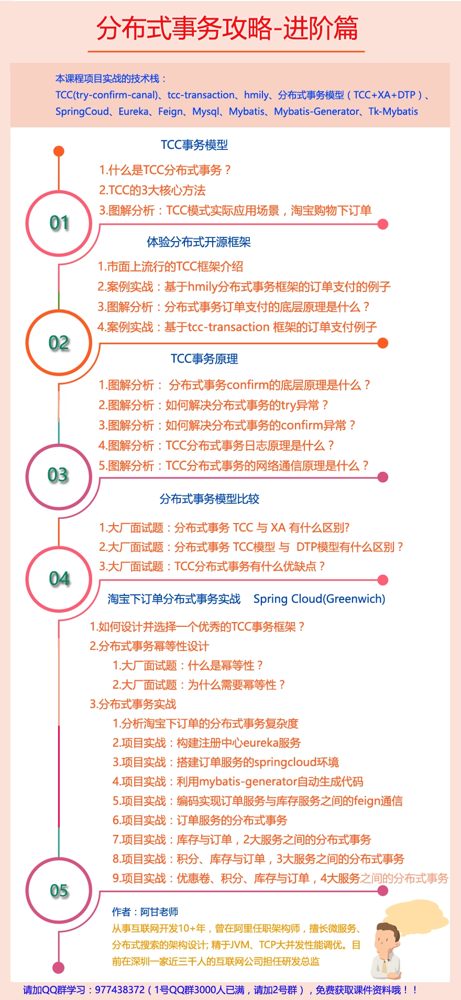

#一、基本概念

##CAP

C：一致性

​	实现方式：强一致性，弱一致性，最终一致性

A：可用性，非故障的节点在**合理的时间内**返回**合理的响应**。


P：分区容错性，要求系统部署在不同的服务器上，集群可用性

​	实现方式：服务拆分，多机部署


**为什么C和A不能同时满足？**

##BASE

BA：Basically Availiable，基本可用，核心功能可用

S：Soft state,软状态，比如订单状态：待付款，已付款，已发货，已签收，已结束

E：Eventually consistent，最终一致性

相当于CAP原则中的一致性和可用性的权衡结果

##1.本地事务

##2.柔性事务

**概念**

符合BASE理论的分布式解决方案，就叫做柔性事务

**典型的柔性事务解决方案**

1) TCC(两阶段型、补偿性)

案例：定婚-领证

二阶段2PC(二阶段提交协议)

补偿就是回滚

2) 可靠消息最终一致性

- 非事务型消息中间件（activemq/rabbitmq/kafka）
- 事务型消息中间件rocketmq

3) 最大努力通知

##3.DTP:分布式事务处理模型

1)DTP是谁提出来的？

x/open,open group 是一个独立的组织，主要负责制定各种行业技术标准

2）DTP模型与XA规范

3) DTP模型

3.1 模型元素：

- 应用程序（Application Program,简称AP）
- 资源管理器（Resource Manager,简称RM），如数据库、文件系统等，并提供访问资源的方式
- 事务管理器（Transaction Manager,简称TM）,负责分配事务唯一标识，监控事务的执行进度，并负责事务的提交，回滚等
- 通信资源管理器（Communication Resource Manager,简称CRM）:控制一个TM域（TM domain）内或者跨TM域的分布式应用之间的通信
- 通信协议（Communication Protocol，简称CP）

3.2 模型示例（Instance Of the Model）

## 4.JTA

概念：Java Transaction Api ，是xa的java实现版

实现：

- J2EE容器提供的JTA实现（JBOSS）
- 独立的JTA实现，如JOTM,Atomikos，可用于Tomcat，jetty，以及普通的java应用
  - Atomikos，用于tomcat等容器

## 5.二阶段协议

第一阶段：准备阶段，锁定所有需要的资源

第二阶段：执行阶段，commit或者rollback

优点：保证了数据的强一致性，适合对数据强一致性要求很高的关键领域

缺点：实现复杂，牺牲了可用性，对性能影响很大，不适合高并发高性能场景。

## 6.XA协议

XA和2PC是相互参考的

比较：

XA:接口，二阶段是协议

二级

## 7.TCC

TCC其实就是采用补偿机制，核心思想是，针对每个操作，都要注册一个与其对应的确认和补偿（撤销）操作。

它分为以下三个阶段：

- Try阶段主要对业务系统进行检测及资源预留
- Confirm阶段主要是对业务系统做确认提交，Try阶段执行成功并开始执行Confirm阶段时，默认Confirm阶段是不会出错的。即只要Try阶段成功，Confirm阶段一定成功
- Cancel阶段主要是在业务执行错误，需要回滚的状态下执行的业务取消，预留资源释放。

TCC是二阶段协议的一种实现，对2PC做了优化，第一个阶段只锁定了一部分资源，剩余的资源其他的事务也可以事务

优点：和2PC比起来，实现以及流程相对简单了一些，但数据的一致性比2PC也要差一些

缺点：缺点还是比较明显的，在第二步和第三步都有可能失败。TCC属于应用层的一种补偿方式，需要程序员在实现的时候多谢很多补偿的代码，在一些场景中，一些业务流程可能用TCC不太好定义和处理。在代码中无法完成事务时，可以通过手工干预。

##比较

DTP:分布式事务处理的模型

XA:数据库和TM之间的接口

XA和2PC是相互参考的，

### XA规范与2PC的关系

XA定义了接口，2PC是具体协议

2PC提交协议并非在XA规范中提出来的，但XA规范定义了2PC提交协议中需要使用的接口

#二、各种分布式事务方案

## 1、两阶段提交方案/XA方案


###2PC

概念:

* P：Prepare phase，准备阶段
* C：Commit phase，提交阶段


### 执行流程

- 第一阶段

  询问

- 第二阶段

  执行

### 适用场景

单块系统，调用多个数据库；但是单块系统同时操作多个数据库，是不合规范的；所以这种方式并不常用

### 优点


### 缺点

严重依赖于数据库层面来搞定复杂的事务，效率很低，绝对不适合高并发的场景；


### 实现方式

spring+JTA


## 2、TCC方案

使用了补偿的概念


###执行流程

* Try阶段：对各个服务的资源做检测以及对资源进行锁定或者预留
* confirm阶段：在各个服务中执行实际的操作
* Cancel阶段：如果任何一个服务的业务方法执行出错，那么这里就需要进行补偿，就是执行已经成功的业务逻辑的回滚操作

### 适用场景

对数据一致性要求很高，是系统中核心的核心，比如资金类的场景

### 优点


### 缺点

回滚严重依赖于业务代码，会造成补偿代码巨大；不具备通用性

实现复杂

### 框架

**ByteTCC,**

**Himly**

**阿里的seata**

```
支持dubbo，springcloud

核心原理：

TC：seata-server

TM

RM

```


## 3、本地消息表

国外的ebay适用的方案

### 执行流程

1. A系统在自己本地一个事务里操作，同时插入一条数据到消息表
2. 接着A系统将这个消息发送到MQ中去
3. B系统接收到消息之后，在一个事务里，网自己本地消息表里面插入一条数据，同时执行其他的业务操作，如果这个消息已经被处理过了，那么此时这个事务会回滚，这样保证不会重复处理消息
4. B系统执行成功以后，就会更新自己本地消息表的状态，以及A系统消息表的状态
5. 如果B系统处理失败了，那么久不会更新消息表状态，那么此时A系统会定时扫描自己的消息表，如果有没被处理的消息，会再次发送到MQ中取，让B再次处理
6. 这个方案保证了最终一致性，哪怕B事务失败了，但是A会不断重发消息，直到B那边成功为止

### 适用场景

###优点

### 缺点

严重依赖于数据库的消息表来管理事务，不能应用于高并发场景

## 4、可靠消息最终一致性方案

这个方案不使用本地消息表，直接基于MQ来实现事务，比如阿里的RocketMQ就支持消息事务

### 执行流程

1. A系统先发送一个prepared消息到MQ，如果这个prepared消息发送失败，那么
2. ​

###适用场景

### 优点

### 缺点

## 5、最大努力通知方案

###适用场景

可以在一定程度上允许少数的分布式事务失败，一般用在对分布式事务要求不严格的场景，比如日志


# 三、面试题

## 1.基础篇

为什么有3阶段方案？

阶段3的单点故障和网络脑裂问题？


## 2.进阶篇

TCC和XA的区别？

TCC和DTP的区别？

TCC的优缺点？




##3.高级篇

