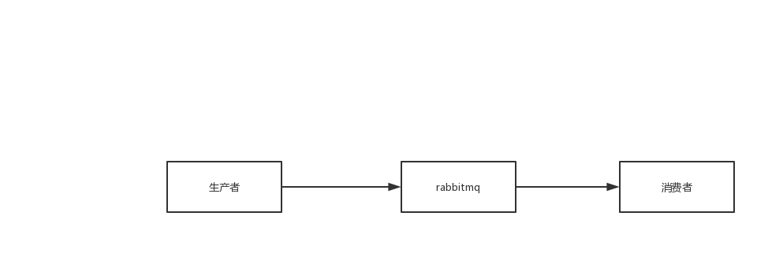

# 一、生产端丢失数据

```
什么是生产端的可靠性投递？
1）、保障消息的成功发出
2）、保障MQ节点的成功接收
3）、发送端收到MQ节点（Broker）确认应答
4）、完善的消息补偿机制
```

```
BAT/TMD互联网大厂的解决方案：
1）、消息落库，对消息状态进行达标，如0表示处理中，1表示收到响应，发送成功，2表示没有响应，发送失败，通过轮询，超过最大次数还没有收到响应
2)、消息的延迟投递，做二次确认，回调检查
```

方案一具体实现：

Step1：业务数据和消息落库，也就是将消息的信息存入库中，带上标志位，表示已发送

Step2：生产端发送消息

Step3：MQ发送确认消息

Step4：设置状态为发送成功

Setp5：获取所有状态为已发送，且超时没有响应的消息

Step6：重新发送

Step7：超过最大重试次数，设置状态为发送失败

方案二具体实现：（注重性能）


## 1、事务：同步

## 2、channel的confirm模式：异步

# 二、rabbitmq丢失数据

两步：

1.设置Queue为durable，保证队列的元数据不丢失

2.设置消息的deliveryMode为2，表示将消息设置为持久化

# 三、消费端丢失数据

开启了AutoAck，自动发送确认，但是消费端可能挂掉，没有处理这条消息。