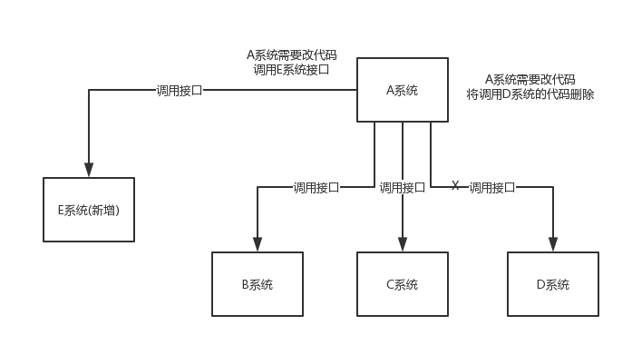

# 一、使用场景（解耦、异步、削峰）

##1.应用解耦合

不使用消息队列：

##2.服务通信

##3.异步任务

##4.削峰填谷

##5.消息广播

# 二、消息协议

## 1、JMS

基于JVM消息代理的规范。

## 2、AMQP

高级消息队列协议，也是一个消息代理的规范，兼容JMS

## 比较：

JMS:仅支持java，不跨语言

AMQP:跨语言

|      | 定义          | 跨平台，跨语言 | Model                  |      | 实现                |
| ---- | ----------- | ------- | ---------------------- | ---- | ----------------- |
| JMS  | java api    | 否       | (1)P2P (2)Pub/sub |      | ActiveMQ，HornetMQ |
| AMQP | 网络级协议，兼容JMS | 是       | 五种                     |      | RabbitMQ          |

# 三、常用的消息队列

##1、RabbitMQ

###1、特点

使用erlang（交换机领域使用的语言），数据延迟低

有较低概率丢失消息

实现了AMQP

10w+ QPS

开源、性能优秀，稳定性保障

集群模式丰富，表达式配置，HA模式，镜像队列模型

###2、核心概念

#####Message:

#####Virtual Host:

#####Publisher

##### Exchange

##### Queue:

##### Binding

##### Connection

##### Channel

##### Consumer

#####Broker

###3、Exchange类型

#### direct:按照键值匹配

#### fanout

#### topic

#### headers

## 2、ActiveMQ

## 3、RocketMQ

## 4、Kafka

## 比较：

| 消息队列\特性  | 单机吞吐量(QPS)                             | topic 数量对吞吐量的影响 | 时效性  | 可用性                                | 消息可靠性            |      |
| -------- | -------------------------------------- | --------------- | ---- | ---------------------------------- | ---------------- | ---- |
| ActiveMQ | 1w+，比RocketMQ、Kafka低一个数量级              |                 |      | 高，基于主从架构实现高可用                      | **有较低的概率丢失数据**   |      |
| RabbitMQ | 1w+                                    |                 |      | 高，基于主从架构实现高可用                      | 基本不丢             |      |
| RocketMQ | 10w+,支持高吞吐                             |                 |      | 非常高，分布式架构                          | 经过参数优化配置，可以做到0丢失 |      |
| Kafka    | 10w+,支持高吞吐，一般配合大数据类的系统进行实时数据计算、日志采集等场景 |                 |      | 非常高，一个数据多个副本，少数机器宕机，不会丢失数据，不会导致不可用 | 经过参数优化配置，可以做到0丢失 |      |

#四、面试题

1.为什么使用消息队列？

2.消息队列有什么优点和缺点？

3.kafka、activeMQ、rabbitMQ,rocketMQ都有什么优点和缺点，以及适合哪些场景？

# 五、你系统的中的使用场景？

发送注册邮件

发送注册短信

# 六、消息服务中的概念

## 1、消息代理（message broker）

## 2、目的地（destination）

当消息发送者发送消息以后，将有消息代理接管，消息代理保证消息传递到指定目的地。

目的地有两种形式：

1）.队列（queue）：点对点消息通信

2）.主题（topic）：发布/订阅